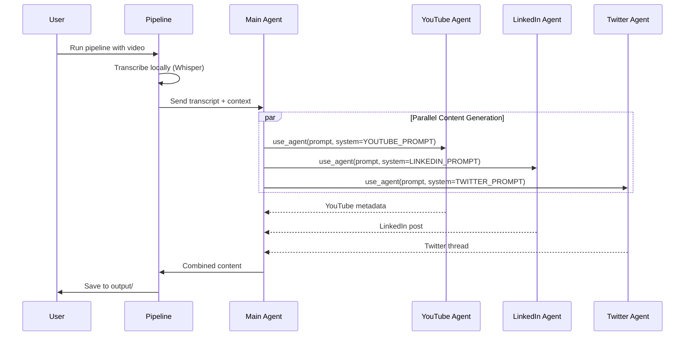

# Content Copy Pipeline

An AI-powered pipeline that transcribes videos and generates optimized social media content for YouTube, LinkedIn, and Twitter.

## 🏗️ Architecture

### System Design

The pipeline uses a **multi-agent architecture** with specialized sub-agents for each platform, orchestrated by a main agent. This design ensures platform-specific optimization while maintaining consistent messaging.

```mermaid
graph TB
    subgraph Input
        V[Video Files<br/>MP4, MP3, WAV, etc.]
    end

    subgraph "Local Processing"
        W[Whisper Model<br/>Local Transcription<br/>No API Required]
    end

    subgraph "Agent Orchestration"
        MA[Main Agent<br/>Pipeline Coordinator<br/>Strands Agent]
    end

    subgraph "Specialized Sub-Agents"
        YT[YouTube Agent<br/>SEO & Metadata<br/>Titles, Tags, Thumbnails]
        LI[LinkedIn Agent<br/>Professional Engagement<br/>Human-Voice Posts]
        TW[Twitter Agent<br/>Thread Generation<br/>Viral Optimization]
    end

    subgraph Output
        OUT1[📄 {video}_content.txt<br/>All Platform Content]
        OUT2[📄 {video}_transcript.txt<br/>Full Transcript]
        OUT3[📄 {video}_metadata.json<br/>Processing Data]
    end

    V -->|1. Load| W
    W -->|2. Transcript| MA
    MA -->|3. Delegate| YT
    MA -->|3. Delegate| LI
    MA -->|3. Delegate| TW
    YT -->|4. Generate| OUT1
    LI -->|4. Generate| OUT1
    TW -->|4. Generate| OUT1
    W -.->|Save| OUT2
    MA -.->|Save| OUT3

    style W fill:#e1f5e1
    style MA fill:#e3f2fd
    style YT fill:#fff3e0
    style LI fill:#f3e5f5
    style TW fill:#e0f2f1
```

### Agent Architecture Design

#### Why Multi-Agent?

**Traditional Approach (Single Agent):**
- One agent tries to handle all platforms
- Generic prompts lead to mediocre results
- No platform-specific expertise
- Inconsistent quality across platforms

**Our Multi-Agent Approach:**
- **Specialized Expertise**: Each sub-agent is an expert in one platform
- **Platform Optimization**: Tailored prompts for YouTube SEO, LinkedIn engagement, Twitter virality
- **Parallel Processing**: Can generate content for all platforms simultaneously
- **Consistent Messaging**: Main agent ensures coherent narrative across platforms

#### Component Breakdown

1. **Local Whisper Transcription**
   - Runs completely on-device
   - No API costs or rate limits
   - Privacy-preserving (videos never leave your machine)
   - Supports 5 model sizes: `tiny`, `base`, `small`, `medium`, `large`

2. **Main Orchestration Agent**
   - Built with [Strands Agents](https://github.com/strands-agents/strands)
   - Coordinates the entire workflow
   - Manages session state and conversation history
   - Delegates to specialized sub-agents using `use_agent` tool

3. **YouTube Sub-Agent**
   - **Expertise**: SEO optimization, discoverability, click-through rates
   - **System Prompt**: Trained on YouTube best practices
   - **Outputs**: 3 title options, rich descriptions, 15-20 tags, thumbnail concepts
   - **Focus**: Front-loading keywords, engagement optimization

4. **LinkedIn Sub-Agent**
   - **Expertise**: Professional engagement, authentic voice
   - **System Prompt**: Emphasizes conversational tone, NOT corporate speak
   - **Outputs**: 1200-1500 char posts with hooks, hashtags, CTAs
   - **Focus**: Human authenticity, discussion generation

5. **Twitter Sub-Agent**
   - **Expertise**: Thread structure, viral mechanics, concise communication
   - **System Prompt**: Optimized for scrolling behavior and engagement
   - **Outputs**: 5-8 tweet threads with hooks, emojis, thread numbering
   - **Focus**: Quotable tweets, standalone value, clear CTAs

#### Agent Communication Flow



#### Key Design Decisions

**1. Sub-Agent Pattern via `use_agent`**
```python
# Each sub-agent gets its own system prompt and model
youtube_content = use_agent(
    prompt=user_prompt,
    model="anthropic/claude-sonnet-4-5-20250929",
    system=YOUTUBE_SYSTEM_PROMPT  # Platform-specific expertise
)
```

**2. Local-First Transcription**
- Privacy: Videos never sent to external APIs
- Cost: Zero transcription costs (was $0.06 per 10-min video)
- Speed: 16x realtime with `base` model on modern CPUs
- Offline: Works without internet connection

**3. Platform-Specific System Prompts**
- Each agent has deeply specialized instructions
- Trained on platform best practices
- Includes do's and don'ts specific to each platform
- Optimizes for different success metrics (SEO vs engagement vs virality)

**4. Smart Placeholder System**
- All content includes `{{YOUTUBE_LINK}}`, `{{CODE_REPO}}`, `{{BLOG_LINK}}`
- Replace before publishing
- Maintains consistent linking strategy across platforms

## 🎯 What It Does

This pipeline automates the content creation workflow:

1. **📹 Video Transcription**: Uses OpenAI's Whisper model (locally) to transcribe video files
2. **🤖 AI Content Generation**: Uses specialized sub-agents to generate platform-specific content:
   - **YouTube**: Titles, descriptions, tags, and thumbnail concepts
   - **LinkedIn**: Engaging, human-sounding posts with strategic formatting
   - **Twitter**: Multi-tweet threads optimized for engagement
3. **📝 Smart Placeholders**: All generated content includes placeholders for `{{YOUTUBE_LINK}}`, `{{CODE_REPO}}`, and `{{BLOG_LINK}}`

## 🚀 Quick Start

### Prerequisites

- Python 3.9+
- Anthropic API key (for content generation)
- FFmpeg (for audio processing - auto-installed with dependencies)

**Note**: Transcription runs locally using Whisper - no API key needed!

### Installation

1. Clone the repository:
```bash
git clone https://github.com/labeveryday/content-copy-pipeline
cd content-copy-pipeline
```

2. Install dependencies:
```bash
pip install -r requirements.txt
```

3. Set up environment variables:
```bash
cp .env.example .env
# Edit .env and add your API keys
```

4. Create directories and add videos:
```bash
mkdir -p videos output transcripts
# Add your video files to the ./videos directory
```

### Basic Usage

Process all videos in the `./videos` directory:
```bash
python run_pipeline.py
```

Process a specific video:
```bash
python run_pipeline.py --video path/to/your/video.mp4
```

With custom parameters:
```bash
python run_pipeline.py \
  --audience "network engineers" \
  --keywords "AWS,DevOps,Cloud" \
  --takeaway "Learn how to optimize cloud infrastructure" \
  --hook "surprising discovery"
```

## 📋 Features

### Video Transcription
- Supports multiple video formats: MP4, MP3, WAV, M4A, WebM, MPEG
- Generates detailed transcripts with timestamps
- Saves transcripts for future reference

### AI-Powered Content Generation

#### YouTube Content
- **3 Title Options**: SEO-optimized, attention-grabbing titles under 60 characters
- **Complete Description**: With sections, timestamps, and CTAs
- **15-20 Tags**: Mix of specific and broad tags for discoverability
- **Thumbnail Description**: Detailed visual concepts with text overlays

#### LinkedIn Posts
- **Engaging Hooks**: Attention-grabbing first 2 lines
- **Human Voice**: Authentic, conversational tone (not corporate speak)
- **Strategic Formatting**: Short paragraphs and line breaks for readability
- **1200-1500 characters**: Optimal LinkedIn length
- **3-5 Hashtags**: Relevant, non-spammy hashtags

#### Twitter Threads
- **Compelling Hook**: First tweet that stops scrollers
- **5-8 Tweet Thread**: Breaking down key concepts
- **Strategic Formatting**: Emojis, thread numbering (1/🧵, 2/🧵)
- **Under 280 Characters**: Each tweet optimized for Twitter
- **CTA Tweet**: Final tweet with links and call-to-action

### Smart Sub-Agents
The pipeline uses specialized AI sub-agents for each platform, ensuring:
- Platform-specific best practices
- Consistent messaging across platforms
- Authentic, human-sounding content
- SEO and engagement optimization

## 🔧 Configuration

### Command Line Options

```bash
python run_pipeline.py [OPTIONS]

Options:
  --video, -v PATH       Process a single video file
  --input, -i DIR        Input directory (default: ./videos)
  --output, -o DIR       Output directory (default: ./output)
  --transcripts, -t DIR  Transcripts directory (default: ./transcripts)

  --title TEXT           Video title
  --audience TEXT        Target audience description
  --keywords TEXT        Comma-separated keywords
  --takeaway TEXT        Main lesson to emphasize
  --context TEXT         Personal context for authenticity
  --hook TEXT            Hook angle for social media

  --model TEXT           AI model (default: claude-sonnet-4-5-20250929)
  --quiet, -q            Suppress verbose output
  --separate             Generate platform content separately
```

### Configuration File

Edit `config.json` to set default parameters:

```json
{
  "pipeline": {
    "input_dir": "./videos",
    "output_dir": "./output",
    "transcripts_dir": "./transcripts"
  },
  "content_generation": {
    "model_id": "claude-sonnet-4-5-20250929",
    "temperature": 0.7
  },
  "default_parameters": {
    "target_audience": "developers and tech professionals"
  }
}
```

## 📁 Project Structure

```
content-copy-pipeline/
├── src/
│   ├── agent.py              # Base Strands agent
│   ├── pipeline.py            # Main pipeline orchestration
│   ├── transcriber.py         # Video transcription module
│   ├── models/
│   │   └── models.py          # Model configurations
│   └── tools/
│       ├── model_selector.py  # Model selection tool
│       └── content_generator.py  # Content generation tools
├── videos/                    # Input videos (create this)
├── output/                    # Generated content (auto-created)
├── transcripts/               # Video transcripts (auto-created)
├── sessions/                  # Agent sessions (auto-created)
├── run_pipeline.py            # CLI script
├── requirements.txt           # Python dependencies
├── config.json                # Configuration
└── .env                       # API keys (create from .env.example)
```

## 📊 Output Files

For each processed video, the pipeline creates:

1. **Transcript File**: `transcripts/{video_name}_transcript.txt`
   - Full text transcript of the video

2. **Content File**: `output/{video_name}_content.txt`
   - All generated social media content
   - YouTube metadata
   - LinkedIn post
   - Twitter thread

3. **Metadata File**: `output/{video_name}_metadata.json`
   - Processing metadata
   - Timestamps
   - Parameters used

4. **Summary Report**: `output/pipeline_report_{timestamp}.txt`
   - Summary of all processed videos
   - Success/failure status

## 🎨 Example Output

### YouTube Title Example
```
AWS Lambda Cost Optimization: Save 70% in 5 Simple Steps
```

### LinkedIn Post Example
```
I just discovered something surprising about AWS Lambda costs...

After analyzing hundreds of Lambda functions, I found that most teams
are overpaying by 70% or more.

The culprit? Three simple configuration mistakes that are incredibly
common but rarely talked about.

In my latest video, I break down:
→ How to right-size your Lambda memory allocation
→ The connection pooling trick that saves thousands
→ Why your timeout settings are costing you money

Full video: {{YOUTUBE_LINK}}
Code examples: {{CODE_REPO}}

What's your biggest Lambda cost challenge? 💬

#AWS #CloudComputing #DevOps #ServerlessArchitecture #CostOptimization
```

### Twitter Thread Example
```
1/🧵 Just saved 70% on AWS Lambda costs with these 5 simple optimizations

Most teams are overpaying and don't even know it

Here's what I learned: 👇

2/🧵 Memory allocation is your #1 cost driver

But here's the trick: more memory = faster execution = lower costs

Finding the sweet spot can cut your bill in half

3/🧵 Connection pooling is a game-changer

Reusing database connections instead of creating new ones on every invocation

Saw a 60% performance boost in my tests

[... continues for 7-8 tweets ...]

8/🧵 Want the full breakdown?

Watch the complete tutorial: {{YOUTUBE_LINK}}
Get the code: {{CODE_REPO}}
Read the guide: {{BLOG_LINK}}

#AWS #Serverless #DevOps
```

## 🛠️ Advanced Usage

### Using as a Python Module

```python
from pipeline import ContentPipeline

# Initialize pipeline
pipeline = ContentPipeline(
    input_dir="./my_videos",
    output_dir="./my_content",
    model_id="claude-sonnet-4-5-20250929"
)

# Process a single video with custom parameters
result = pipeline.process_video(
    video_path="./my_videos/tutorial.mp4",
    video_title="AWS Tutorial",
    target_audience="cloud engineers",
    keywords="AWS, Lambda, Serverless",
    key_takeaway="How to optimize Lambda costs",
    hook_angle="surprising cost optimization trick"
)

print(f"Content saved to: {result['content_file']}")
```

### Using Individual Tools

```python
from transcriber import VideoTranscriber

# Just transcribe a video
transcriber = VideoTranscriber()
result = transcriber.transcribe_video("video.mp4")
print(result["text"])
```

## 🤝 Contributing

Contributions are welcome! Please feel free to submit a Pull Request.

## 📄 License

[Add your license here]

## 🙏 Acknowledgments

- Built with [Strands Agents](https://github.com/strands-agents/strands)
- Transcription powered by [OpenAI Whisper](https://openai.com/research/whisper)
- Content generation powered by [Anthropic Claude](https://www.anthropic.com/)

## 📞 Support

For issues or questions, please [open an issue](https://github.com/labeveryday/content-copy-pipeline/issues) on GitHub
