# Content Copy Pipeline

An AI-powered pipeline that transcribes videos and generates optimized social media content for YouTube, LinkedIn, and Twitter.

> **New to this project?** Check out the [QUICKSTART.md](QUICKSTART.md) for a 5-minute setup guide!

## 🏗️ Architecture

### System Design

The pipeline uses a **multi-agent architecture** with specialized sub-agents for each platform, orchestrated by a main agent. This design ensures platform-specific optimization while maintaining consistent messaging.

```mermaid
graph TB
    subgraph Input
        V[Video Files<br/>MP4, MP3, WAV, etc.]
    end

    subgraph "Local Processing"
        W[Whisper Model<br/>Local Transcription<br/>No API Required]
    end

    subgraph "Agent Orchestration"
        MA[Main Agent<br/>Pipeline Coordinator<br/>Strands Agent]
    end

    subgraph "Specialized Sub-Agents"
        YT[YouTube Agent<br/>SEO & Metadata<br/>Titles, Tags, Thumbnails]
        LI[LinkedIn Agent<br/>Professional Engagement<br/>Human-Voice Posts]
        TW[Twitter Agent<br/>Thread Generation<br/>Viral Optimization]
    end

    subgraph Output
        OUT1[📄 video_content.txt<br/>All Platform Content]
        OUT2[📄 video_transcript.txt<br/>Full Transcript]
        OUT3[📄 video_metadata.json<br/>Processing Data]
    end

    V -->|1. Load| W
    W -->|2. Transcript| MA
    MA -->|3. Delegate| YT
    MA -->|3. Delegate| LI
    MA -->|3. Delegate| TW
    YT -->|4. Generate| OUT1
    LI -->|4. Generate| OUT1
    TW -->|4. Generate| OUT1
    W -.->|Save| OUT2
    MA -.->|Save| OUT3

    style W fill:#e1f5e1
    style MA fill:#e3f2fd
    style YT fill:#fff3e0
    style LI fill:#f3e5f5
    style TW fill:#e0f2f1
```



### Agent Architecture Design

#### Why Multi-Agent?

**Traditional Approach (Single Agent):**
- One agent tries to handle all platforms
- Generic prompts lead to mediocre results
- No platform-specific expertise
- Inconsistent quality across platforms

**Our Multi-Agent Approach:**
- **Specialized Expertise**: Each sub-agent is an expert in one platform
- **Platform Optimization**: Tailored prompts for YouTube SEO, LinkedIn engagement, Twitter virality
- **Parallel Processing**: Can generate content for all platforms simultaneously
- **Consistent Messaging**: Main agent ensures coherent narrative across platforms

#### Component Breakdown

1. **Local Whisper Transcription**
   - Runs completely on-device
   - No API costs or rate limits
   - Privacy-preserving (videos never leave your machine)
   - Supports 5 model sizes: `tiny`, `base`, `small`, `medium`, `large`

2. **Pipeline Orchestration Agent**
   - Built with [Strands Agents](https://strandsagents.com/latest/)
   - Coordinates the entire workflow
   - Manages session state and conversation history
   - Has access to tools that invoke specialized content and rating agents
   - Supports custom prompts and conversational interactions

3. **YouTube Content Agent** (Persistent Instance)
   - **Expertise**: SEO optimization, discoverability, click-through rates
   - **System Prompt**: Trained on YouTube best practices
   - **Outputs**: 3 title options, rich descriptions, 15-20 tags, thumbnail concepts
   - **Focus**: Front-loading keywords, engagement optimization
   - **Configured via**: `config/models.yaml` or `--content-provider`

4. **LinkedIn Content Agent** (Persistent Instance)
   - **Expertise**: Professional engagement, authentic voice
   - **System Prompt**: Emphasizes conversational tone, NOT corporate speak
   - **Outputs**: 1200-1500 char posts with hooks, hashtags, CTAs
   - **Focus**: Human authenticity, discussion generation
   - **Configured via**: `config/models.yaml` or `--content-provider`

5. **Twitter Content Agent** (Persistent Instance)
   - **Expertise**: Thread structure, viral mechanics, concise communication
   - **System Prompt**: Optimized for scrolling behavior and engagement
   - **Outputs**: 5-8 tweet threads with hooks, emojis, thread numbering
   - **Focus**: Quotable tweets, standalone value, clear CTAs
   - **Configured via**: `config/models.yaml` or `--content-provider`

6. **Rating Agent** (Persistent Instance)
   - **Expertise**: Content strategy and quality assessment
   - **System Prompt**: Expert content critic with platform-specific criteria
   - **Outputs**: Concise 1-page ratings with actionable feedback
   - **Focus**: Platform-specific strengths, weaknesses, and improvements
   - **Configured via**: `config/models.yaml` or `--rating-provider`

#### Agent Communication Flow


#### Key Design Decisions

**1. Persistent Agent Architecture**
```python
# Agents initialized once at startup with configured models
from config_loader import get_model_config

content_model = get_model_config('content_agents')  # From config/models.yaml
youtube_agent = Agent(model=content_model, system_prompt=YOUTUBE_SYSTEM_PROMPT)

# Tools invoke persistent agents (not recreated each time)
@tool
def generate_youtube_content(transcript: str) -> str:
    return youtube_agent(prompt)  # Reuses existing agent instance
```

**Benefits:**
- Better performance (agents initialized once, not per-request)
- Centralized configuration via `config/models.yaml`
- Easy provider switching (Anthropic → OpenAI → Ollama)
- CLI overrides without code changes

**2. Flexible Model Configuration**
```yaml
# config/models.yaml
content_agents:
  provider: anthropic  # or openai, ollama
  model_id: claude-sonnet-4-5-20250929
  max_tokens: 8000
```

**CLI Overrides:**
```bash
# Use OpenAI for content generation
--content-provider openai --content-model gpt-4

# Mix providers (Anthropic pipeline, Ollama content)
--pipeline-provider anthropic --content-provider ollama
```

**3. Local-First Transcription**
- Privacy: Videos never sent to external APIs
- Cost: Zero transcription costs (was $0.06 per 10-min video)
- Speed: 16x realtime with `base` model on modern CPUs
- Offline: Works without internet connection

**4. Platform-Specific System Prompts**
- Each agent has deeply specialized instructions
- Trained on platform best practices
- Includes do's and don'ts specific to each platform
- Optimizes for different success metrics (SEO vs engagement vs virality)

**5. Smart Placeholder System**
- All content includes `{{YOUTUBE_LINK}}`, `{{CODE_REPO}}`, `{{BLOG_LINK}}`
- Replace before publishing
- Maintains consistent linking strategy across platforms

## 🎯 What It Does

This pipeline automates the content creation workflow:

1. **📹 Video Transcription**: Uses OpenAI's Whisper model (locally) to transcribe video files
2. **🤖 AI Content Generation**: Uses specialized sub-agents to generate platform-specific content:
   - **YouTube**: Titles, descriptions, tags, and thumbnail concepts
   - **LinkedIn**: Engaging, human-sounding posts with strategic formatting
   - **Twitter**: Multi-tweet threads optimized for engagement
3. **📝 Smart Placeholders**: All generated content includes placeholders for `{{YOUTUBE_LINK}}`, `{{CODE_REPO}}`, and `{{BLOG_LINK}}`

## ⚙️ Model Configuration

The pipeline uses a flexible model configuration system that supports multiple AI providers:

**Supported Providers:**
- **Anthropic** (Claude) - Default, best quality
- **OpenAI** (GPT models)
- **Ollama** (Local models)

**Configuration File:** `config/models.yaml`

```yaml
pipeline_agent:      # Main orchestration agent
  provider: anthropic
  model_id: claude-sonnet-4-5-20250929

content_agents:      # YouTube, LinkedIn, Twitter generators
  provider: anthropic
  model_id: claude-sonnet-4-5-20250929

rating_agent:        # Content quality rating
  provider: anthropic
  model_id: claude-sonnet-4-5-20250929
```

**CLI Overrides:**
```bash
# Use OpenAI for content generation
python run_pipeline.py --content-provider openai --content-model gpt-4

# Mix providers (Anthropic for pipeline, Ollama for content)
python run_pipeline.py --pipeline-provider anthropic --content-provider ollama --content-model qwen3:4b
```

## 🚀 Quick Start

### Prerequisites

- Python 3.9+
- **At least one AI provider API key:**
  - Anthropic API key (recommended)
  - OpenAI API key (optional)
  - Ollama installed locally (optional)
- FFmpeg (for audio processing - auto-installed with dependencies)

**Note**: Video transcription runs locally using Whisper - no API costs!

### Installation

1. **Clone and setup:**
```bash
git clone https://github.com/labeveryday/content-copy-pipeline
cd content-copy-pipeline
pip install -r requirements.txt
```

2. **Configure API keys:**
```bash
cp .env.example .env
# Edit .env and add your ANTHROPIC_API_KEY (or OPENAI_API_KEY)
```

3. **Add your videos:**
```bash
mkdir -p videos
# Copy your video files to ./videos/
```

### Basic Usage

**Process a video:**
```bash
python run_pipeline.py --video videos/my-video.mp4
```

**Process with custom parameters:**
```bash
python run_pipeline.py --video my-video.mp4 \
  --audience "developers" \
  --keywords "Python,AI,Automation"
```

**Custom prompts (conversational mode):**
```bash
python run_pipeline.py --video my-video.mp4 \
  --prompt "Generate 10 engaging YouTube titles"
```

**Rate existing content:**
```bash
python run_pipeline.py --rate output/my-video_content.txt
```

**Switch AI providers:**
```bash
# Use OpenAI instead of Anthropic
python run_pipeline.py --video my-video.mp4 --content-provider openai

# Use local Ollama
python run_pipeline.py --video my-video.mp4 --content-provider ollama --content-model llama3.1:latest
```

## 📋 Features

### Video Transcription
- Supports multiple video formats: MP4, MP3, WAV, M4A, WebM, MPEG
- Generates detailed transcripts with timestamps
- Saves transcripts for future reference

### AI-Powered Content Generation

#### YouTube Content
- **3 Title Options**: SEO-optimized, attention-grabbing titles under 60 characters
- **Complete Description**: With sections, timestamps, and CTAs
- **15-20 Tags**: Mix of specific and broad tags for discoverability
- **Thumbnail Description**: Detailed visual concepts with text overlays

#### LinkedIn Posts
- **Engaging Hooks**: Attention-grabbing first 2 lines
- **Human Voice**: Authentic, conversational tone (not corporate speak)
- **Strategic Formatting**: Short paragraphs and line breaks for readability
- **1200-1500 characters**: Optimal LinkedIn length
- **3-5 Hashtags**: Relevant, non-spammy hashtags

#### Twitter Threads
- **Compelling Hook**: First tweet that stops scrollers
- **5-8 Tweet Thread**: Breaking down key concepts
- **Strategic Formatting**: Emojis, thread numbering (1/🧵, 2/🧵)
- **Under 280 Characters**: Each tweet optimized for Twitter
- **CTA Tweet**: Final tweet with links and call-to-action

### Smart Sub-Agents
The pipeline uses specialized AI sub-agents for each platform, ensuring:
- Platform-specific best practices
- Consistent messaging across platforms
- Authentic, human-sounding content
- SEO and engagement optimization

### Content Rating & Feedback
Built-in quality assurance with an expert rating agent:
- **Automated Ratings**: 1-10 scale for each platform
- **Detailed Feedback**: Specific strengths and weaknesses
- **Actionable Suggestions**: Concrete improvements
- **Quality Tracking**: Ratings saved to metadata for analysis

## 📊 Rating System

Get detailed feedback on your generated content using an expert content strategy agent.

### How It Works

The rating agent analyzes your content across multiple dimensions:

**YouTube Content:**
- SEO optimization and keyword placement
- Title appeal and hook strength
- Description completeness and CTAs
- Tag diversity and searchability
- Thumbnail concept effectiveness

**LinkedIn Posts:**
- Hook effectiveness (first 2 lines)
- Authenticity and human voice
- Formatting and readability
- Value delivery and insights
- Engagement potential

**Twitter Threads:**
- Hook tweet strength
- Thread structure and flow
- Character optimization
- Formatting and visual appeal
- CTA effectiveness

### Usage

Rate any generated content file:
```bash
python run_pipeline.py --rate output/video_content.txt
```

**Example Output:**
```
📊 Rating Content: video_content.txt
🤖 Analyzing content quality and providing feedback...

📋 RATING & FEEDBACK

YOUTUBE CONTENT: 8/10
Strengths:
- Strong SEO optimization with front-loaded keywords
- Compelling title options that create curiosity
- Comprehensive description with clear value proposition

Areas for Improvement:
- Consider adding more specific technical tags
- Thumbnail description could be more specific about colors

LINKEDIN POST: 9/10
Strengths:
- Excellent hook that grabs attention immediately
- Authentic, conversational tone throughout
- Strategic use of line breaks and formatting

Areas for Improvement:
- Could add one more hashtag for broader reach

TWITTER THREAD: 7/10
Strengths:
- Strong opening hook that stops scrolling
- Good use of emojis and thread numbering

Areas for Improvement:
- Tweet 3 is 285 characters (over limit)
- Could make tweets more quotable

OVERALL: 8/10
Recommendation: Minor edits suggested, then publish

✅ Rating saved to metadata file
```

### Rating Storage

Ratings are automatically saved to your metadata files:
```json
{
  "video_file": "videos/tutorial.mp4",
  "content_file": "output/tutorial_content.txt",
  "rating": {
    "feedback": "Detailed rating analysis...",
    "rated_at": "2025-11-11T15:30:00",
    "rating_model": "claude-sonnet-4-5-20250929"
  }
}
```

This allows you to:
- Track content quality over time
- Identify patterns in what works best
- Compare ratings across different videos
- Build a quality improvement workflow

## 🔧 Configuration

### Command Line Options

```bash
python run_pipeline.py [OPTIONS]

Content Options:
  --video, -v PATH       Process a single video file
  --prompt TEXT          Custom prompt for pipeline agent
  --title TEXT           Video title
  --audience TEXT        Target audience description
  --keywords TEXT        Comma-separated keywords
  --takeaway TEXT        Main lesson to emphasize
  --context TEXT         Personal context for authenticity
  --hook TEXT            Hook angle for social media

Model Configuration:
  --pipeline-provider    Provider for pipeline agent (anthropic/openai/ollama)
  --pipeline-model       Model ID for pipeline agent
  --content-provider     Provider for content agents (anthropic/openai/ollama)
  --content-model        Model ID for content agents
  --rating-provider      Provider for rating agent (anthropic/openai/ollama)
  --rating-model         Model ID for rating agent
  --whisper-model        Whisper model size (tiny/base/small/medium/large)

Directory Options:
  --input, -i DIR        Input directory (default: ./videos)
  --output, -o DIR       Output directory (default: ./output)
  --transcripts, -t DIR  Transcripts directory (default: ./transcripts)

Other Options:
  --rate CONTENT_FILE    Rate existing content and provide feedback
  --quiet, -q            Suppress verbose output
  --separate             Generate platform content separately
```

### Configuration File

Edit `config/models.yaml` to set default models:

```yaml
# Main pipeline orchestration agent
pipeline_agent:
  provider: anthropic
  model_id: claude-sonnet-4-5-20250929
  max_tokens: 8000
  temperature: 1.0
  thinking: false

# Content generation agents (YouTube, LinkedIn, Twitter)
content_agents:
  provider: anthropic
  model_id: claude-sonnet-4-5-20250929
  max_tokens: 8000
  temperature: 1.0
  thinking: false

# Content rating agent
rating_agent:
  provider: anthropic
  model_id: claude-sonnet-4-5-20250929
  max_tokens: 4000
  temperature: 1.0
  thinking: false
```

**Note:** CLI options override config file settings.

## 📁 Project Structure

```
content-copy-pipeline/
├── config/
│   └── models.yaml            # Model configuration (providers, model IDs)
├── src/
│   ├── config_loader.py       # Configuration loader
│   ├── pipeline.py            # Main pipeline orchestration
│   ├── transcriber.py         # Local Whisper transcription
│   ├── models/
│   │   └── models.py          # Model factory functions
│   └── tools/
│       ├── content_generator.py  # YouTube, LinkedIn, Twitter agents
│       └── content_rater.py      # Content rating agent
├── videos/                    # Input videos (create this)
├── output/                    # Generated content (auto-created)
│   ├── *_content.txt          # Platform-specific content
│   ├── *_metadata.json        # Processing metadata
│   └── *_rating.txt           # Content quality ratings
├── transcripts/               # Video transcripts (auto-created)
├── sessions/                  # Agent conversation sessions (auto-created)
├── run_pipeline.py            # CLI entry point
├── requirements.txt           # Python dependencies
└── .env                       # API keys (create from .env.example)
```

## 📊 Output Files

For each processed video, the pipeline creates:

1. **Transcript File**: `transcripts/{video_name}_transcript.txt`
   - Full text transcript of the video

2. **Content File**: `output/{video_name}_content.txt`
   - All generated social media content
   - YouTube metadata
   - LinkedIn post
   - Twitter thread

3. **Metadata File**: `output/{video_name}_metadata.json`
   - Processing metadata
   - Timestamps
   - Parameters used

4. **Summary Report**: `output/pipeline_report_{timestamp}.txt`
   - Summary of all processed videos
   - Success/failure status

## 🎨 Example Output

### YouTube Title Example
```
AWS Lambda Cost Optimization: Save 70% in 5 Simple Steps
```

### LinkedIn Post Example
```
I just discovered something surprising about AWS Lambda costs...

After analyzing hundreds of Lambda functions, I found that most teams
are overpaying by 70% or more.

The culprit? Three simple configuration mistakes that are incredibly
common but rarely talked about.

In my latest video, I break down:
→ How to right-size your Lambda memory allocation
→ The connection pooling trick that saves thousands
→ Why your timeout settings are costing you money

Full video: {{YOUTUBE_LINK}}
Code examples: {{CODE_REPO}}

What's your biggest Lambda cost challenge? 💬

#AWS #CloudComputing #DevOps #ServerlessArchitecture #CostOptimization
```

### Twitter Thread Example
```
1/🧵 Just saved 70% on AWS Lambda costs with these 5 simple optimizations

Most teams are overpaying and don't even know it

Here's what I learned: 👇

2/🧵 Memory allocation is your #1 cost driver

But here's the trick: more memory = faster execution = lower costs

Finding the sweet spot can cut your bill in half

3/🧵 Connection pooling is a game-changer

Reusing database connections instead of creating new ones on every invocation

Saw a 60% performance boost in my tests

[... continues for 7-8 tweets ...]

8/🧵 Want the full breakdown?

Watch the complete tutorial: {{YOUTUBE_LINK}}
Get the code: {{CODE_REPO}}
Read the guide: {{BLOG_LINK}}

#AWS #Serverless #DevOps
```

## 🛠️ Advanced Usage

### Using as a Python Module

```python
from pipeline import ContentPipeline

# Initialize pipeline
pipeline = ContentPipeline(
    input_dir="./my_videos",
    output_dir="./my_content",
    model_id="claude-sonnet-4-5-20250929"
)

# Process a single video with custom parameters
result = pipeline.process_video(
    video_path="./my_videos/tutorial.mp4",
    video_title="AWS Tutorial",
    target_audience="cloud engineers",
    keywords="AWS, Lambda, Serverless",
    key_takeaway="How to optimize Lambda costs",
    hook_angle="surprising cost optimization trick"
)

print(f"Content saved to: {result['content_file']}")
```

### Using Individual Tools

```python
from transcriber import VideoTranscriber

# Just transcribe a video
transcriber = VideoTranscriber()
result = transcriber.transcribe_video("video.mp4")
print(result["text"])
```

## 🤝 Contributing

Contributions are welcome! Please feel free to submit a Pull Request.

## 📄 License

[Add your license here]

## 🙏 Acknowledgments

- Built with [Strands Agents](https://strandsagents.com/latest/)
- Transcription powered by [OpenAI Whisper](https://github.com/openai/whisper)
- Content generation powered by [Anthropic Claude](https://www.anthropic.com/)

## 📞 Support

For issues or questions, please [open an issue](https://github.com/labeveryday/content-copy-pipeline/issues) on GitHub
